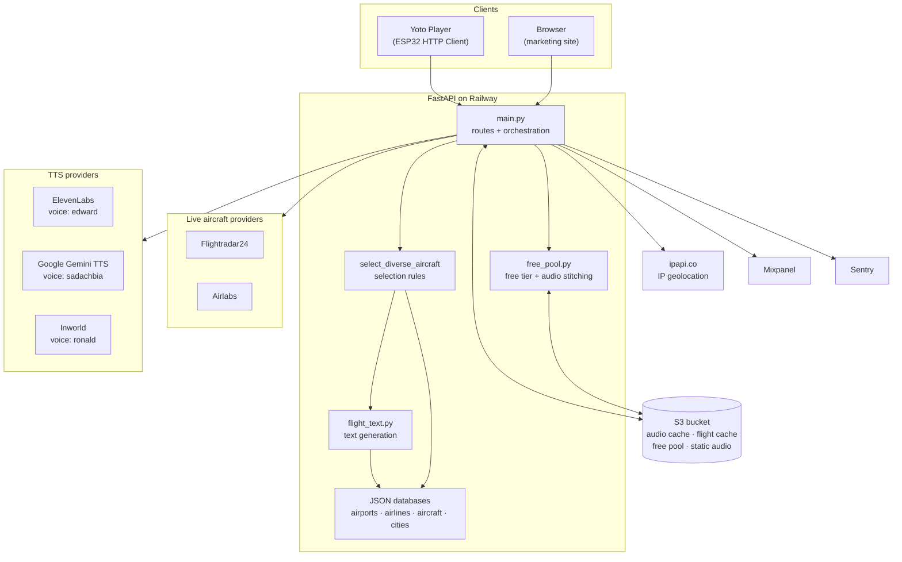
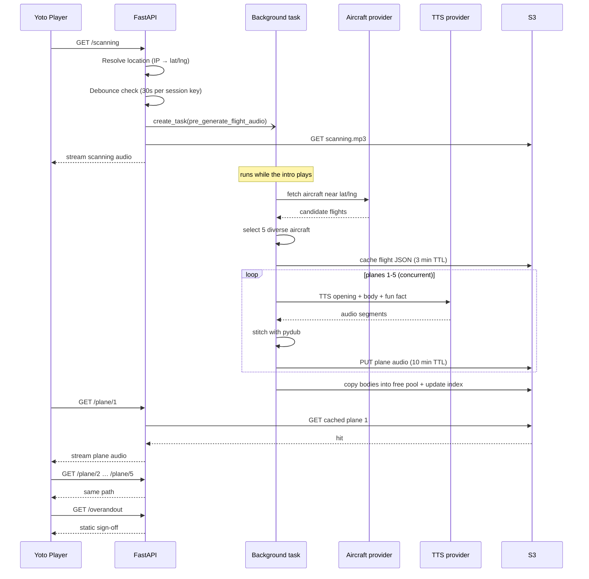
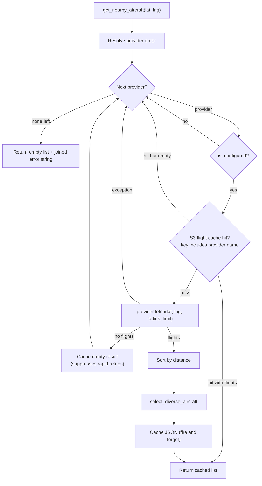
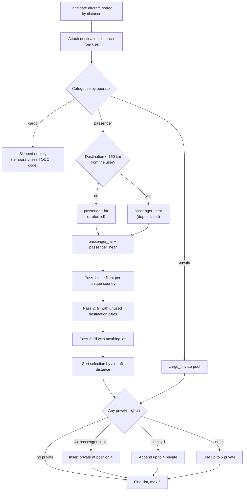
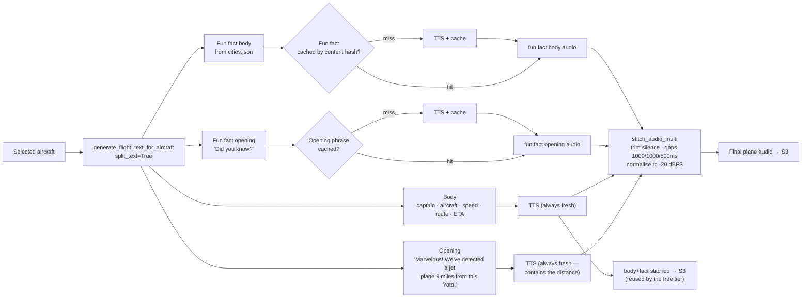
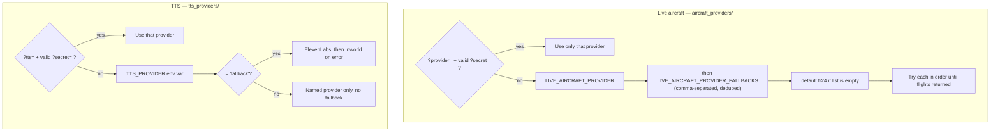
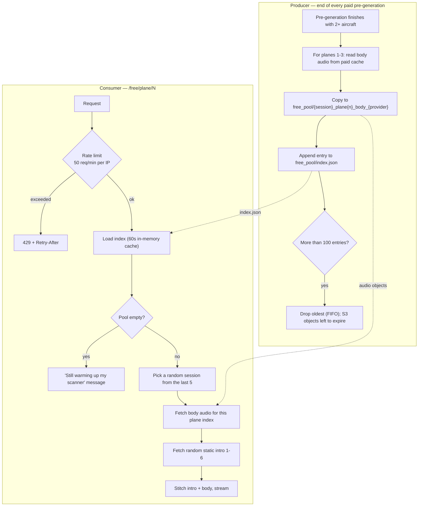
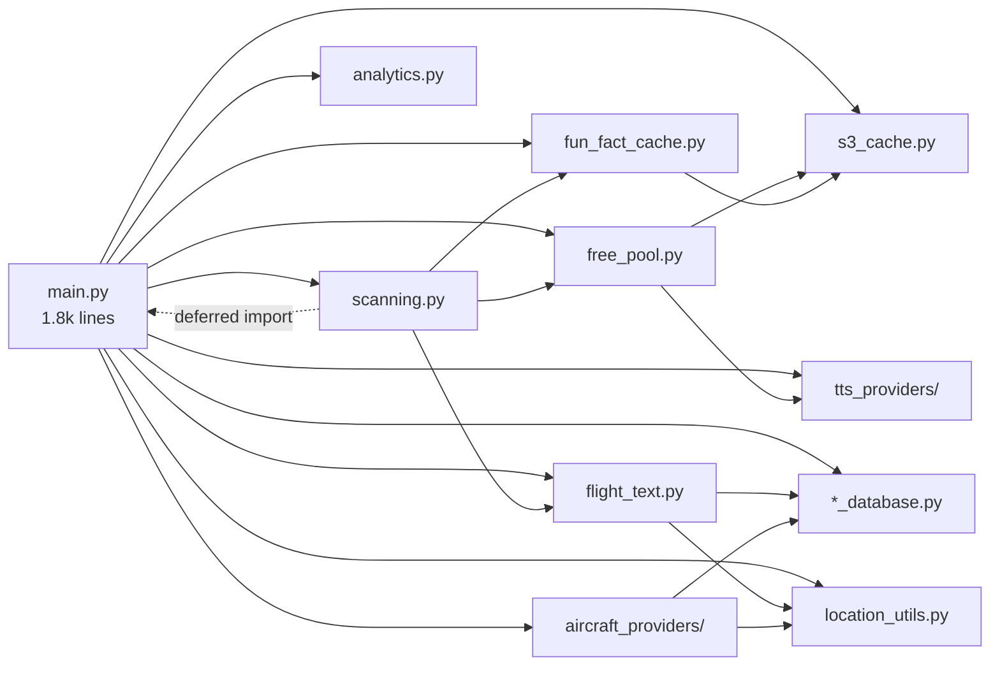

# Architecture

How `dreaming-of-a-jet-plane` turns a button press on a Yoto Player into a spoken
description of a real aircraft overhead.

- [The shape of the system](#the-shape-of-the-system)
- [A full card session](#a-full-card-session)
- [Where the aircraft come from](#where-the-aircraft-come-from)
- [From aircraft to audio](#from-aircraft-to-audio)
- [Provider resolution and fallback](#provider-resolution-and-fallback)
- [Free tier](#free-tier)
- [The cache](#the-cache)
- [Module map](#module-map)
- [Analytics](#analytics)
- [Sharp edges](#sharp-edges)

---

## The shape of the system

One FastAPI process on Railway. It owns no database — every piece of durable
state lives in a single S3 bucket, and everything else is in-process memory that
dies with the container.

**Endpoints**, grouped by what they actually do:

| Group | Paths | Behaviour |
|---|---|---|
| Static audio | `/intro`, `/scanning-again`, `/overandout` (+ `.mp3` aliases) | Proxy a pre-recorded file from the voice's S3 folder |
| Scan trigger | `/scanning` | Streams `scanning.mp3` **and** kicks off pre-generation in the background |
| Content | `/plane/1` … `/plane/5` | Serve cached audio, or generate it on the spot |
| Free tier | `/free/scan`, `/free/scanning`, `/free/scanning-again`, `/free/overandout`, `/free/plane/1-3` | Replay audio generated for a paying user, rate-limited |
| Site | `/`, `/robots.txt`, `/sitemap.xml`, `/assets/*` | Marketing page (`website_home.py`) |
| Debug | `/test/live-aircraft`, `/test-gemini-tts` | Provider inspection pages |

Every audio endpoint also has an `@app.options` twin returning permissive CORS
headers.

---

## A full card session

This is the load-bearing idea in the whole codebase: **`/scanning` is not just an
intro clip, it is the warm-up.** While the child listens to ~15 seconds of
"scanning the skies…", the server is fetching flights and generating five MP3s in
parallel. By the time the card advances to `/plane/1`, the audio should already be
sitting in S3.

If the cache misses — the child skipped ahead, pre-generation is still running, or
it failed — `/plane/N` does the whole fetch-and-generate chain inline, which is
several seconds slower but produces the same output.

The 30-second debounce in `scanning.py` exists because the Yoto client is prone to
re-requesting; a duplicate request inside the window still gets its audio but
skips the background work and the analytics event.

---

## Where the aircraft come from

`get_nearby_aircraft()` in `main.py` is the single entry point. It walks the
provider list in order and returns from the first one that produces flights.

Both providers query a bounding box derived from a 100 km radius, then normalise
wildly different payloads into one shared aircraft dict — `flight_number`,
`airline_name`, `origin_city`, `destination_city`, `distance_km`, `eta`,
`is_cargo_operator`, `is_private_operator`, and so on. Enrichment comes from the
bundled JSON databases: IATA → city/country, ICAO → airline name and cargo/private
flags, aircraft ICAO → friendly name, seat count, and phonetic spelling.

The two providers are **not** equivalent in how much cleaning they need:

| | Flightradar24 | Airlabs |
|---|---|---|
| Filter | `categories=P` (passenger) at the API | `status == "en-route"` client-side |
| ETA | Provided by the API | Estimated from distance ÷ cruise speed, plus a landing buffer |
| Position trust | Trusted | Validated against the great-circle route (`is_point_near_route`) — stale positions are common |
| Airline naming | Direct ICAO lookup | Overrides for regional carriers (Endeavor → Delta, Republic flight-number ranges → AA/UA/DL) |
| Retry | None (10s timeout) | 2 attempts, 0.5s → 1s backoff, 4s timeout |

The route validation on the Airlabs side is the most opinionated code in the
repo. It rejects a flight if the user is nowhere near its origin→destination
great circle, if the user sits outside a 10°-margin bounding box around the route,
or if the closest approach exceeds 50% of the total route length — the last check
catches short private-jet hops that report implausible positions.

### Selection rules

Raw provider results are noisy: five flights to the same hub, or the same
regional shuttle five times. `select_diverse_aircraft()` optimises for *variety*,
not proximity.

Nearby destinations are pushed down the list deliberately: a flight from the next
town over is less interesting than one crossing an ocean, and the fun fact about
the destination city is worthless if the child already lives there.

---

## From aircraft to audio

Each plane's script is built from four segments, and each is generated and cached
independently so the expensive-but-repeatable parts can be reused.

Splitting the text is what makes the free tier possible. The opening names a
distance that is only true for the user who triggered the scan, but the body —
airline, route, aircraft, fun fact — is true for anybody. So the body is cached
separately and later paired with a generic pre-recorded opening.

Fun facts are cached by **content hash**, not by city, which gives free
invalidation: editing a fact in `cities.json` changes the hash and misses the
cache; removing one leaves an orphan that S3 lifecycle rules eventually reap.

The text itself is heavily randomised — opening exclamation, captain surname,
aircraft adjective, movement verb, which stat gets mentioned, which of four fun
fact openers is used, and a kid-scale ETA comparison ("about how long it takes to
read three bedtime stories"). Units follow the user's country: imperial for
`US`, `GB`, and seven others, metric elsewhere. Numbers are spelled out for TTS
("BA123" → "B A one two three") because the models otherwise mangle them.

If split TTS fails at any point, the code falls back to a single TTS call on the
full concatenated sentence. If TTS fails entirely, `/plane/N` returns JSON with
the text and the error instead of audio.

---

## Provider resolution and fallback

Two independent provider systems, same shape: a registry dict mapping a name to
`{display_name, is_configured, ...}`, resolved at request time.

The TTS provider choice cascades further than it looks. It determines the audio
format (`opus` for ElevenLabs and Inworld, `mp3` for Google), the MIME type, the
S3 folder for static clips (`edward` / `sadachbia` / `ronald`), and it is baked
into every cache key — so switching providers invalidates the entire audio cache
by construction.

`PROVIDER_OVERRIDE_SECRET` gates all overrides, including the `lat`/`lng`
position override. Without it configured, override query params are silently
ignored; with it configured, a wrong secret is logged with the client IP.

---

## Free tier

Free users don't trigger any live API calls. They "tune into" flights that a
paying user's scan already produced.

Consequences worth knowing: the free tier is empty on a cold start until a paying
user scans; free content is stale by design (up to 100 sessions old); free audio
is read with `get_raw()`, bypassing the TTL check that governs the paid cache,
because the index — not the object age — is what controls its lifetime.

---

## The cache

One S3 bucket, several key spaces with different rules. There is no other
persistence layer.

| Key pattern | Contents | TTL | Read path |
|---|---|---|---|
| `cache/{md5}_aircraft.json` | Selected flights for a location + provider | 3 min | `get(content_type="json")` |
| `cache/{md5}_plane{n}_{provider}.{ext}` | Finished plane audio | 10 min | `get()` |
| `cache/{md5}_plane{n}_body_{provider}.{ext}` | Body (+fact) audio, for free-tier reuse | 10 min | `get_raw()` |
| `cache/fun_facts/{hash}_{provider}.{ext}` | Fun fact audio | none — content-hashed | `get_raw()` |
| `cache/fun_facts/openings/{hash}_{provider}.{ext}` | "Did you know?" etc. | none | `get_raw()` |
| `free_pool/index.json` | Session index, max 100 FIFO | none | `get_raw()` |
| `free_pool/{session}_plane{n}_body_{provider}.{ext}` | Free tier body audio | none | `get_raw()` |
| `free/intros/flight-intro-{1..6}.{ext}` | Generic free openings | static | `get_raw()` |
| `{voice}/intro.mp3`, `scanning.mp3`, … | Per-voice static clips | static | Public HTTPS GET |

The location hash is `md5("{lat:.2f},{lng:.2f}")` — roughly 1 km precision, so
neighbours share cache entries. The JSON key adds a `provider:{name}` namespace
so a fallback provider can't read the primary's results.

TTL is enforced on read, not by S3: `get()` issues a `HEAD`, compares
`Last-Modified` against the TTL, and treats anything older as a miss. Timeouts are
tiered — 3s for `HEAD`, 30s for `GET`, 60s for `PUT` — so a cache probe fails fast
while a real download gets room. Uploads retry with jittered exponential backoff
on 503 `SlowDown`. A shared `httpx` client (100 connections, 50 keep-alive) is
reused across the process.

Writes are almost always `asyncio.create_task(...)` — fire-and-forget, so a slow
S3 PUT never delays the audio stream.

### In-memory state

| Where | What | Lifetime |
|---|---|---|
| `location_utils._ip_cache` | IP → lat/lng/city | 24h (5 min for rate-limit fallbacks) |
| `scanning._scanning_request_cache` | Session key → last scan time | 30s debounce window |
| `free_pool._free_pool_index_cache` | Parsed index | 60s |
| `free_pool._rate_limit_cache` | IP → request timestamps | 60s window |

All four are plain module-level dicts. They are per-container and unbounded — fine
for one Railway replica, but they would need rethinking before scaling out, and
the rate limiter in particular becomes per-replica rather than global.

---

## Module map

| Module | Responsibility |
|---|---|
| `main.py` | Routes, TTS dispatch, aircraft fetch + selection, analytics helpers, free tier handlers |
| `scanning.py` | `/scanning` endpoint, debounce, background pre-generation of all 5 planes |
| `flight_text.py` | All user-facing text; unit localisation; TTS-friendly number spelling |
| `flight_text_seasonal.py` | Date-driven sentence overrides (e.g. holiday messages) |
| `free_pool.py` | Free tier index, rate limiting, and all pydub audio stitching |
| `s3_cache.py` | Hand-rolled SigV4 S3 client, key generation, TTL, retries |
| `fun_fact_cache.py` | Content-hashed fun fact audio caching |
| `location_utils.py` | IP geolocation + cache, haversine, great-circle route validation, UA parsing |
| `aircraft_providers/` | `fr24.py`, `airlabs.py` + registry — normalise flights to one dict shape |
| `tts_providers/` | `elevenlabs.py`, `google.py`, `inworld.py` + registry — text → audio bytes |
| `*_database.py` | Read-only JSON lookups: airports, airlines, aircraft, cities |
| `analytics.py` | Thin Mixpanel wrapper; swallows its own failures |
| `website_home.py` | Marketing page, robots.txt, sitemap |

The dotted arrow is real: `scanning.py` imports from `main.py` inside function
bodies to break the import cycle. It appears throughout `intro.py`,
`overandout.py`, and `scanning_again.py` too.

---

## Analytics

Mixpanel, with a `distinct_id` of `md5(ip + user_agent)[:16]` and an `$insert_id`
on every event for deduplication. Yoto Players are detected by their
`ESP32 HTTP Client/1.0` user agent and relabelled from "Other" to "Yoto Player".

| Event | Fired when | Notable properties |
|---|---|---|
| `scan:start` | `/scanning` or a `/free/*` entry point | `subscription` |
| `scan:complete` | Aircraft fetch resolves | `nearby_aircraft`, `aircraft_provider`, `from_cache` |
| `plane:request` | Any `/plane/N` or `/free/plane/N` | `plane_index`, `from_cache`, `free_pool_entry_id` |
| `generate:audio` | TTS produces a plane's audio | `generation_time_ms`, `tts_provider`, `fun_fact_source`, `fun_fact_cache_hit`, origin/destination |
| `error:location` | IP geolocation fails or falls back | `failure_type`, `fallback_location` |
| `intro`, `scanning-again`, `overandout` | Static clip streamed | Location, device |

Every tracking call is wrapped in `try/except` — analytics failures never reach
the user. Sentry sits alongside it for exceptions, sampling 10% of traces, with
the environment inferred from `RAILWAY_REPLICA_ID`.

---

## Sharp edges

Things that are true today and would surprise a reader of the code.

- **Cargo flights are excluded entirely.** `select_diverse_aircraft` drops them
  with a `TODO` saying it's temporary; only private operators reach the
  cargo/private slot.
- **A NameError is being swallowed in the Airlabs ETA path.**
  `aircraft_providers/airlabs.py:313` uses `aircraft_type` before it is assigned
  at line 353. The surrounding `try/except Exception` catches it, so ETA
  estimation silently yields `None` for the first flight and reuses the previous
  flight's type thereafter.
- **The free-tier rate limit docstring disagrees with the code** — 10/min in the
  docstring, `FREE_TIER_RATE_LIMIT = 50` in the constant.
- **`populate_free_pool` is passed 5 aircraft but only loops over planes 1-3**,
  matching the three free endpoints; the docstring still says "up to 5 planes".
- **`s3_cache.generate_cache_key`'s fallback format map says
  `elevenlabs → mp3`**, while the TTS registry says ElevenLabs produces `opus`.
  Harmless today because every real call passes `audio_format` explicitly, but
  it's a trap for a future caller that doesn't.
- **`/plane/N` accepts a `tts` query parameter it never reads** — the override is
  re-extracted from the raw request inside `get_tts_provider_override`, so the
  declared parameter is decorative.
- **Fallback location is New York City.** Any geolocation failure puts the child
  over NYC, and plane 1 says so out loud.

---

*Generated from the code as of the `docs/architecture-overview` branch. Diagrams
are Mermaid and render natively on GitHub.*
